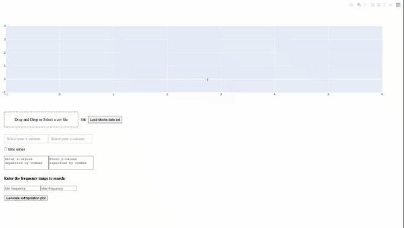

#### This repo is currently a work in progress.

We solve the least squares problem using trigonometric polynomials with non-integer degree. The basis functions are [1, sin(ax), cos(bx)] where a,b can take on any value. There is also error handling for invalid inputs.

You can navigate into the venv directory with `cd venv`, then load the requirements and launch the app with the following commands:

`pip install -r requirements.txt`

`python app.py`

#### Current features:
- [x] uploading csvs with the option to select columns corresponding to x- and y- variables
- [x] error handling for invalid csvs or data
- [x] display the interpolating trigonometric polynomial within the chart
- [x] grid search of optimal a,b values for the period of the sine and cosine base functions
- [x] ability to select the index of the dataframe (convenient for timeseries data)
- [x] ability to modify the period of the basis functions (this might be important for more practical applications such as real data sets)
- [x] calculate and show metrics determining the least squares fit (r2)

#### Features in progress: 
- [ ] extrapolation of points not on the chart (e.g. evaluate f(10) for chart x range of [-5, 5])
- [ ] specify the range of the function to display

#### Example below:
#### 
